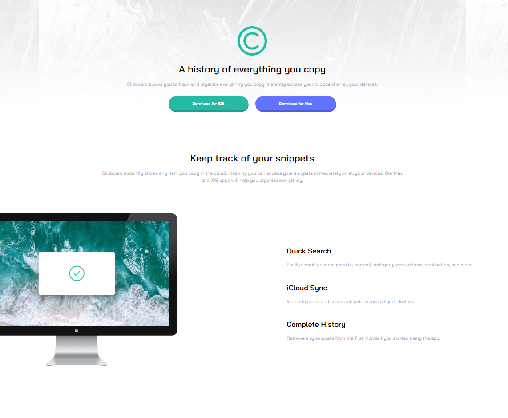
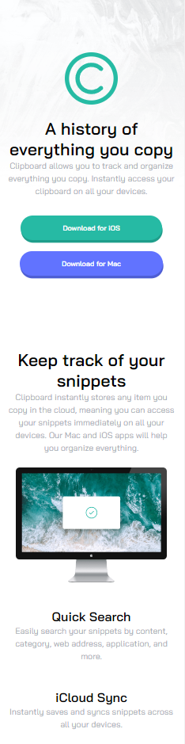

# Frontend Mentor - Clipboard landing page solution

This is a solution to the [Clipboard landing page challenge on Frontend Mentor](https://www.frontendmentor.io/challenges/clipboard-landing-page-5cc9bccd6c4c91111378ecb9). Frontend Mentor challenges help you improve your coding skills by building realistic projects. 

## Table of contents

- [Overview](#overview)
  - [The challenge](#the-challenge)
  - [Screenshot](#screenshot)
  - [Links](#links)
- [My process](#my-process)
  - [Built with](#built-with)
  - [What I learned](#what-i-learned)
  - [Useful resources](#useful-resources)
- [Author](#author)

## Overview

### The challenge

Users should be able to:

- View the optimal layout for the site depending on their device's screen size
- See hover states for all interactive elements on the page

### Screenshot





### Links

- Solution URL: [https://github.com/veronicajujuy/cipboard-landing-page](https://github.com/veronicajujuy/cipboard-landing-page)
- Live Site URL: [https://cipboard-landing-page-ten.vercel.app/](https://cipboard-landing-page-ten.vercel.app/)

## My process

### Built with

- Semantic HTML5 markup
- CSS custom properties
- Flexbox
- Mobile-first workflow


### What I learned

I learned how to change the color of an svg archive

```html
<svg class="logo-contacto-ref" width="24" height="24" xmlns="http://www.w3.org/2000/svg"><path fill="currentcolor" ...
```


### Useful resources

- [Cambiar el color de un svg con css](https://www.unidadvirtual.com/insertar-svg-en-web-y-cambiar-su-color-al-pasar-mouse-con-css) - This helped me to underestand to change the property fill in svg.

## Author

- Frontend Mentor - [@veronicajujuy](https://www.frontendmentor.io/profile/veronicajujuy)
